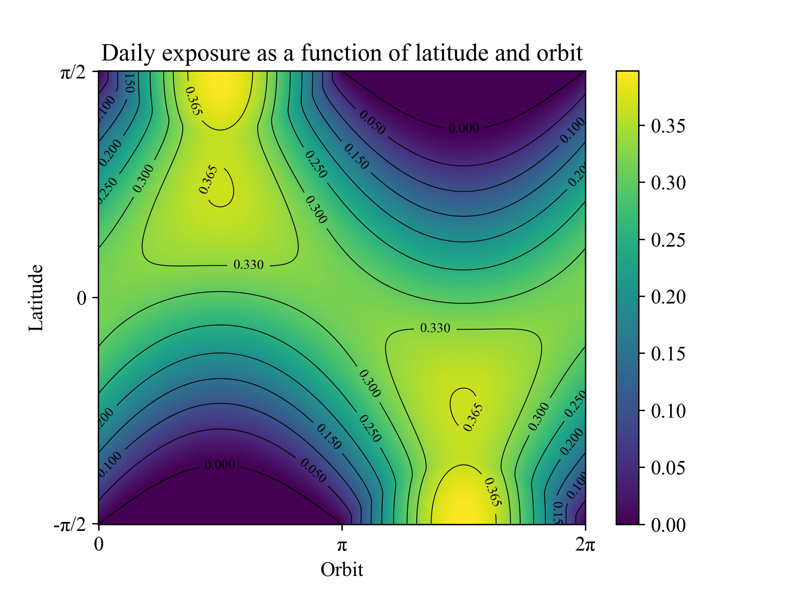

# TMA4195-Project-Global-warming
### Atmospheric models related to global warming
This repo contains the report for group project regarding building a mathematical model for the Earth's climate in the course TMA4195 Mathematical modelling. The code for the report can be found at [this repo](https://github.com/aledha/TMA4195-Project). 

The figure below is an exerpt from the report. The picture is plotting the daily Sun exposure (daily irradiance) on the Earth as a function of latitude and the location in the orbit. The $y$-axis is the lattitude coordinate of the Earth; $-\pi/2$ is the south pole, $0$ is the equator, and $\pi/2$ is the north pole. The $x$-axis is the location of the Earth in it's orbit around the Sun. From the Earths perspective, $0$ is the day when the Sun passes the equator from the south to the north. This makes $\pi/2$ the December solstice for the northern hemisphere.

  

<i>3D Simulation of the Three Body Problem</i>

The following exerpt is from the report's introduction: " The goal of this project is to develop a mathematical model to examine the effect of different factors on the global temperature. The Earth gets energy from the Sun in the form of radiation. This radiation is either absorbed or reflected by the Earth’s atmosphere or the Earth itself. In the first part of this project we focus on the amount of absorbed radiation and heat transfers between the Earth and the atmosphere, and how the absorbed radiation affects temperatures. However it is also important to take into consideration polar regions. Due to the low temperatures at the poles, ice sheets form which have a high capacity to reflect solar radiation, thus lowering the temperature. Therefore in the second part of this project we examine heat fluxes from equatorial to polar regions and the Earth’s capacity to reflect radiation.
